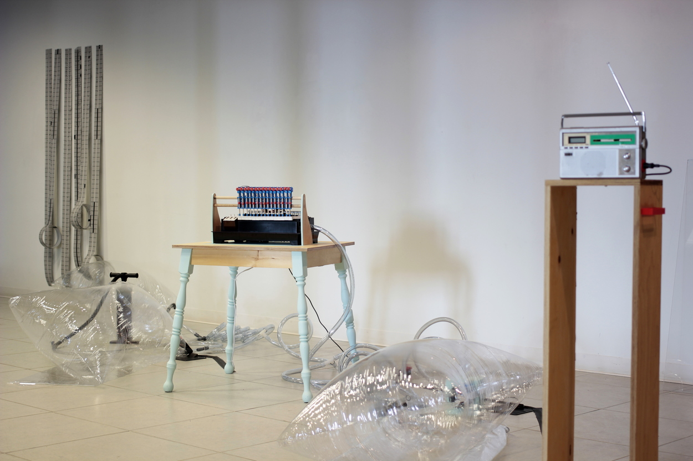

Beep-Boopatronics
*********************

Basic Info
==========
- **Year:** 2017
- **Materials:** servos, 3d printed plastic, vinyl air pillows, PVC tubes, and Beep-Boop Machine
- **Dimensions:** variable

Description
===========
This project reflects an obsession with wires, communication, and out-of-date consumer products. In order to do so, this installation dismantles objects which are on the outer edge of their usable life and imbuing them with new, but not always useful, functionality. Connected by a series of inputs and outputs, the system plays out an absurd comic moment where all of the machinery forces airflow and data into a small instrument, playing an indecipherable tune. Through its are and circuits, this project explores how systems of translation and adaptation can be productive for their own sake.

.. raw:: html

    <iframe width="560" height="315" src="https://www.youtube-nocookie.com/embed/mpJQyF-S-P0?rel=0" frameborder="0" allow="autoplay; encrypted-media" allowfullscreen></iframe>

Tech Specs and Maintenance
------------------------------
This project is just a bit fragile. The air pillows are suspectible to damage, and the servo motors will eventually wear and fail in interesting ways. However, this project survived my thesis presentation, and has already been re-exhibited in a condensed form at the Propeller gallery in downtown Toronto.

Additional Images
=================
.. image:: ./images/The_Piano_Player.JPG
    :width: 650px

Further Reading
==================
- **Blog post:** https://maxlupo.com/beep-boopatronics/
- **More (full resolution) images:** https://drive.google.com/drive/folders/1eJJ13gDr1zyWy0rnHU4PIPVZBJQd9ycE
- **Playing an adapted John Cage composition:** https://youtu.be/Uxc-VaRnjG4 
- **Master's thesis (pdf)**: http://openresearch.ocadu.ca/id/eprint/1625/1/Lupo_Max_2017_MFA_IAMD_Thesis.pdf
- **Source files:**
    - **Piano Player source code:** https://github.com/mlupo/piano-player
    - **Alternate (midi enabled) Beep-Boop Machine source code:** https://github.com/mlupo/music-punch/blob/master/main-piano.py
    - **3D printer files:** https://www.thingiverse.com/thing:2654830
