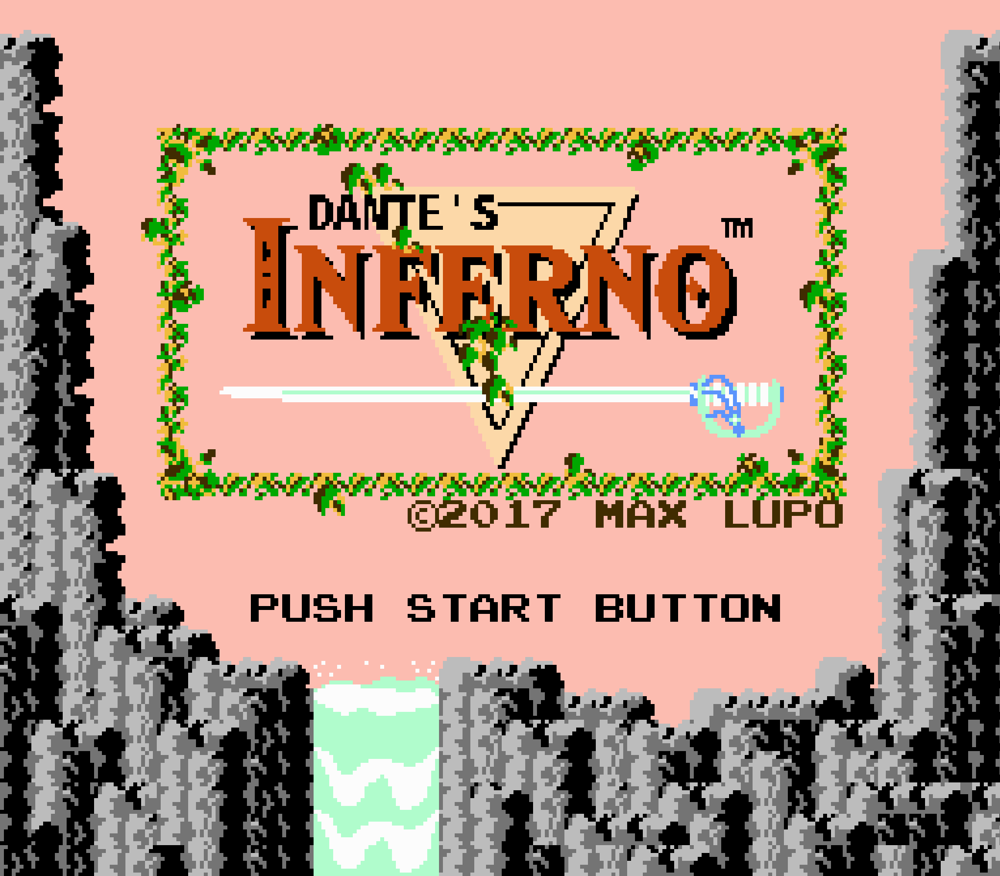

Dante's Inferno
*********************

Basic Info
==========
- **Year:** 2017
- **Materials:** NES game cartridge, NES system, CRT television
- **Dimensions:** variable

Description
===========
Dante's Inferno is a `mod <https://en.wikipedia.org/wiki/Mod_(video_gaming)>`_ of the classic NES game, The Legend of Zelda. This is a work in progress game mod, created to alter the story and graphics of the original game. Specifically, the simple story text in the game has been replaced to include my translation of the first passage from Dante's Inferno. The process of translation was my first (humorously misguided) attempt to try and learn Italian.

Tech Specs and Maintenance
------------------------------
Just like Super Lupo Bros., the game is meant to run on vintage hardware using a number of specific materials, all of which I can provide. In terms of maintenance: the objects involved are standard consumer electronics which should not require excessive maintenance, and their use is reasonably straight forward.

Further Reading
==================
- **Blog post:** *forthcoming*
