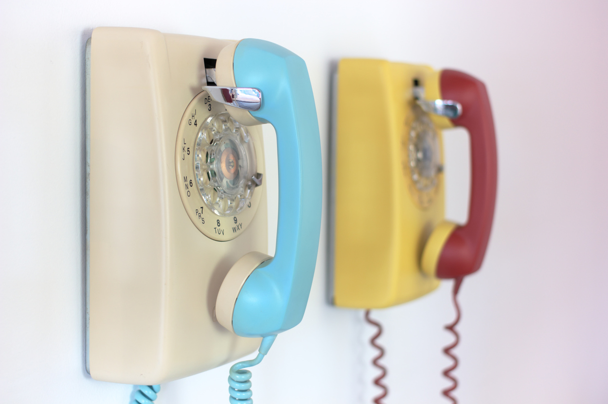

# Dial Me a Story Phone

## Basic Info
- **Year:** 2013-2014
- **Materials:** rotary phone, Arduino
- **Dimensions:**  w 4.5”, h 8”, d 3”

## Description
The Dial Me a Story Phone is a device made to help bring a little story into your ear. The body is a classic Northern Telecom rotary phone, but when a number is dialed a story stored on the phone will play through the ear piece. Around the time this project began I was having some oddly vivid dreams which I wrote down upon waking. As a result, the first set of stories on the device were a selection of dreams that I recorded. During the first exhibition that included the phone, I offered visitors an opportunity to record their own stories on a voice recorder, or write it down on a typewriter. Most of these stories are now on the phone, and I am always trying to accumulate more.

    <iframe width="560" height="315" src="https://www.youtube-nocookie.com/embed/fHtOo81_-xk?rel=0" frameborder="0" allow="autoplay; encrypted-media" allowfullscreen></iframe>

### Tech Specs and Maintenance
This device includes an embedded Arduino microcontroller and a standard SD card. To power up or down the device simply flip the inline power switch. It is recommended to power down the artwork at the end of the day. This is a durable artwork that has been exhibited multiple times without incident. As there are no writes being made to the SD card it is **very** unlikely that the it can become corrupted, but a back-up card is hidden in the device if this were to happen. Access to the electronics is provided by pressing down a clip on the bottom of the phone's base.

## Further Reading
- **Blog post:** <https://maxlupo.com/the-dial-me-a-story-phone/>
- **Full resolution images:** <https://drive.google.com/drive/folders/1I_lah3CKN6hFKChfDXNz7Q_3fXbULJjP>
