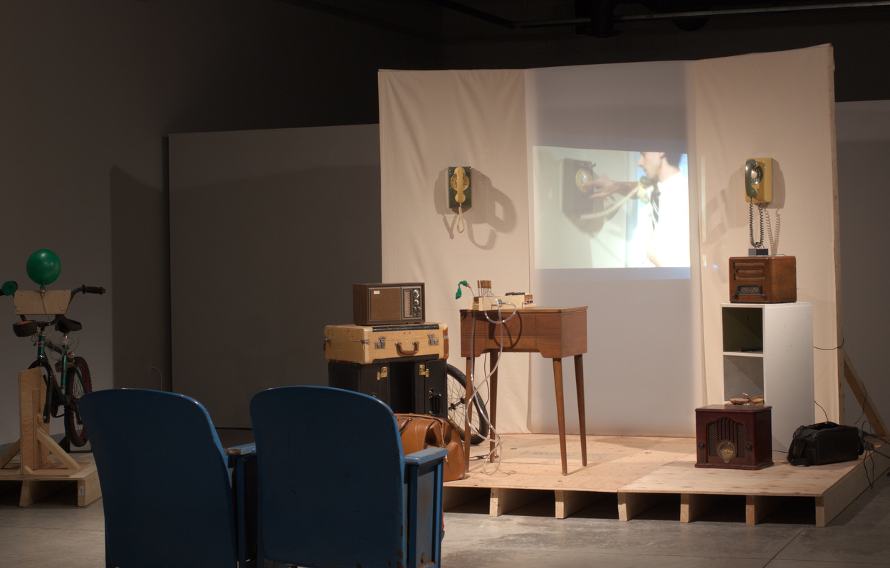
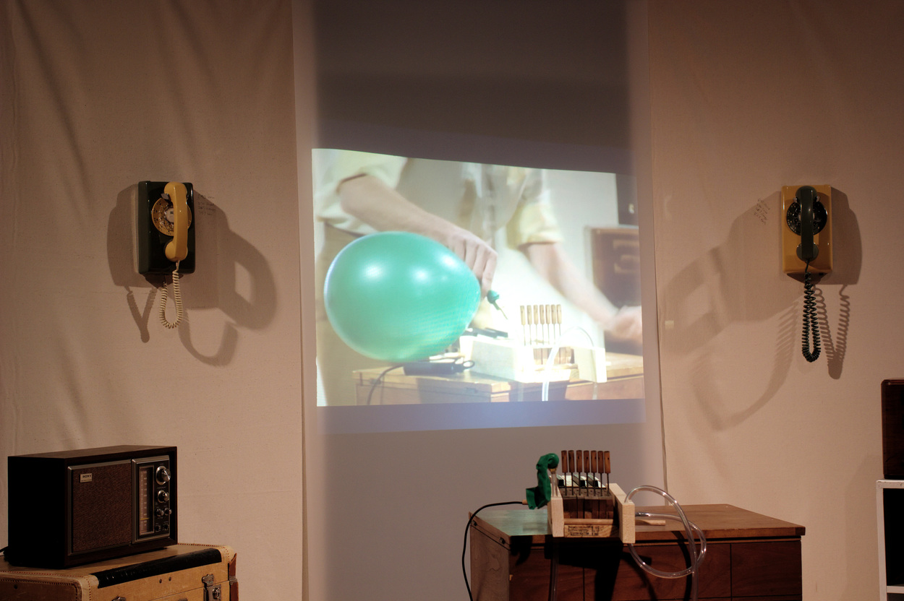
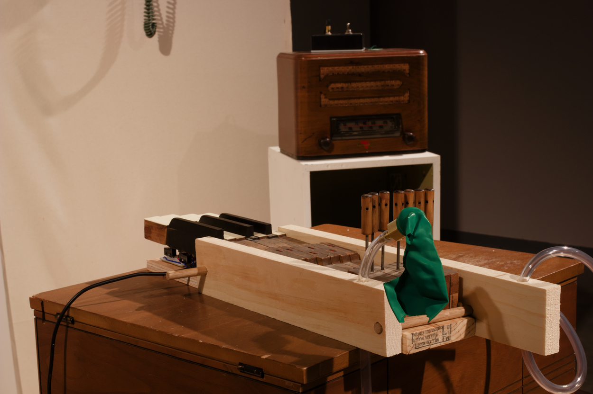

# I MADE THIS FOR YOU

## Basic Info
**Year:** 2015  
**Medium:** a performance and installation  
**Dimensions:** variable

## Description
This performance was part of an exhibition at Georgian College in Barrie, Ontario. This artwork deals with a favorite area of focus: how can feelings of nostalgia and novelty subvert the viewer's expectations of an object or experience. Things such as a rotary phone, a FM radio, and a bicycle are all present, but nothing quite works as it should: the phones only play stories, the radio's only loop static and local audio piped in form the phones, and the bike is just there to blow-up a balloon.

    <iframe width="560" height="315" src="https://www.youtube-nocookie.com/embed/Z8z9Puo24y8?rel=0" frameborder="0" allow="autoplay; encrypted-media" allowfullscreen></iframe>

The exhibition takes a humorous and strange set of objects, and places them a bit closer to a personal context: these things that I made for you.

## Additional Images

## Further Reading
**Blog post:** <https://maxlupo.com/i-made-this-for-you/>  
**Full resolution images:** <https://drive.google.com/drive/folders/16hs3ISQN4Q3XSOnU3C6cJqXF2zddoI97>
