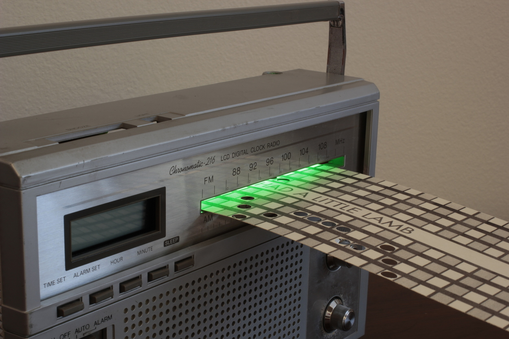
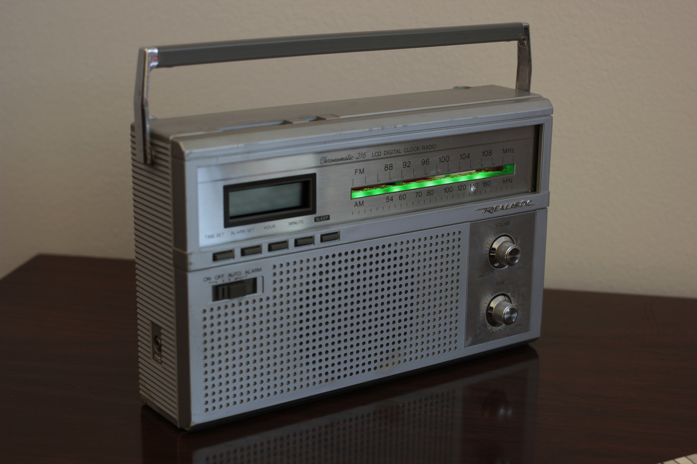

Just Another Beep-Boop Machine
******************************

Basic Info
==========
- **Year:** 2016
- **Materials:** FM Radio, Servo motor, LEDs
- **Dimensions:** w 10", h 7", d 2.5"

Description
===========
The Just Another Beep-Boop Machine is a small artwork, made to play with music. A participant can punch holes in the provided cards, which are then used as the input information for the device to play a tune. The cards can be used to reproduce familiar songs, or to just punch as many holes as you can to see what happens. This project represents both my fixation on translating data from one form to another, and my continued exploration of music boxes.

.. raw:: html

    <iframe width="560" height="315" src="https://www.youtube-nocookie.com/embed/OQMbFPYHY8g?rel=0" frameborder="0" allow="autoplay; encrypted-media" allowfullscreen></iframe>

Tech Specs and Maintenance
------------------------------
This artwork contains a small microcontroller running `Micropython <https://micropython.org/>`_. The device can be powered down by simply pulling its power supply out from the wall. It is recommended to power the device down at night. Once it is plugged back in, it will automatically start up and be ready for input.

In terms of ongoing maintenance, the device relies on a punching holes into cards I have made specifically for the machine. The hole punches and paper are provided, and can be used by any participant. This device requires power from an outlet to operate.

Additional images
=================

Further Reading
==================
- **Blog post:** https://maxlupo.com/just-another-beep-boop-machine/
- **Full resolution images:** https://drive.google.com/drive/folders/1Aj0vJUzPZ4ZRAwEEnRUUYlsMdmx7lrOi
- **Source files:**
    - Source code running on the device: https://github.com/mlupo/music-punch
    - 3D printer files: http://www.thingiverse.com/thing:1305712
