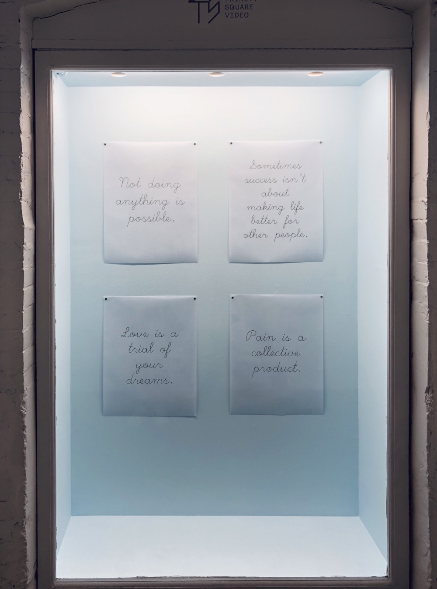

Machine Made Wisdom
*********************

Basic Info
==========
- **Year:** 2019
- **Materials:** graphic marker on isometric grid vellum
- **Dimensions:** 17.5" x 22"

Description
===========
Overly generic platitudes are often used as a way to quell emotional unease, while avoiding the actual substance of that unease. Phrases along the lines of "no good deed goes unpunished", "better late than never", or "everything happens for a reason" are just not good enough. As a whole these platitudes offer the false impression of wisdom, and are packaged as obviously "true" statements that evade further inspection.

At a bare minimum, new phrases that more accurately speak to the underlying sources of pain or disappointment should exist. The phrases below were developed by merging a database of existing platitudes, with bodies of work by different historical authors (Karl Marx, Friedrich Nietzsche, Gertrude Stein, and more), in an attempt to combine the authors’ insights with the discursive style of the platitude. Some of the resulting quotes include:

"Pain is a collective product"

"What you want is sometimes broken"

"Every choice comes with bitter agony"

"Giving up doesn’t always mean you are able to benefit from the mistakes of others"

For this project, a sentence is created through a  semi-random process where the next word is generated on the probability of it occurring after the current word. This process is called Markov chaining, and the implementation used here is the Markovify library, developed at BuzzFeed. This is similar to the process used for my Mansfield Reporter project.

Installation Images
=================

Further Reading
==================
- **Blog post:** https://maxlupo.com/machine-made-wisdom/
- **Full resolution images:** *forthcoming*
