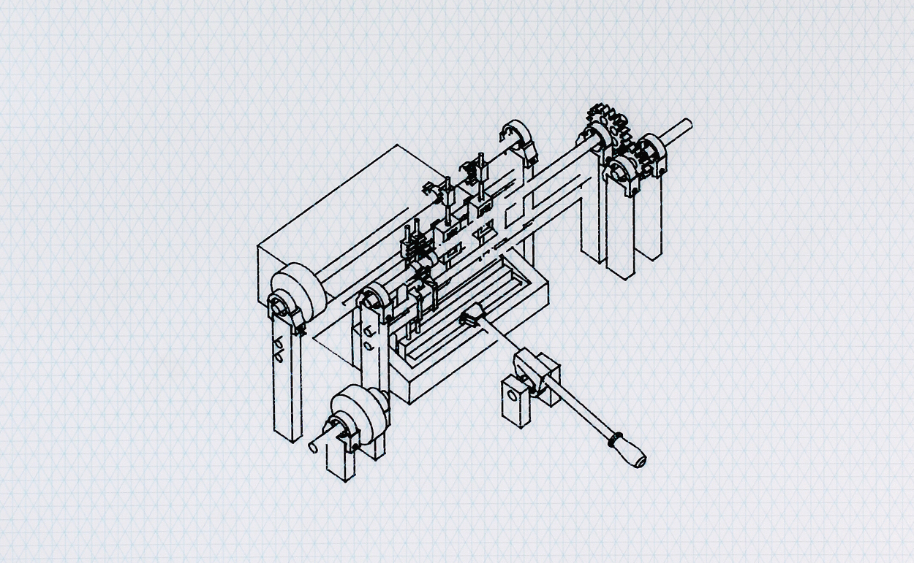

Plot Lines
*********************

Basic Info
==========
- **Year:** 2018
- **Materials:** graphic marker on isometric grid vellum
- **Dimensions:** 17.5" x 22"

Description
===========
Related to my continued interest in porting things from one form into another, the Plot Lines project takes a digital drawing and expresses it physically. Many of my projects rely on the creation of 3D models to plan out how the completed object will work, or the models themselves are 3D printed and used to complete the object. 3D printed parts are integral to objects such as the `Just Another Beep-Boop Machine <https://www.thingiverse.com/thing:1305712>`_, and for objects such as `The Convenient Typer <https://www.thingiverse.com/thing:16954>`_, and `Beep-Boopatronics <https://www.thingiverse.com/thing:2654830>`_ a complex 3D model was made to design the interaction between the 3D printed parts and the existing physical objects. The Plot Lines project was an opportunity to take these 3D models, and renders them as independent drawings.

.. image:: ./images/pl_gears.jpg
    :width: 650px

To complete this project the 3D models were rendered into `vector <https://en.wikipedia.org/wiki/Scalable_Vector_Graphics>`_ image files, then drawn onto the vellum using a `pen plotter <https://en.wikipedia.org/wiki/Plotter>`_. In this case the pen plotter used was actually a converted vinyl cutter whose blade was replaced with a 3D printed pen attachment.

Additional Images
=================

.. image:: ./images/pl_bearing-holder.jpg
    :width: 650px

.. image:: ./images/pl_tooth-box.jpg
    :width: 650px

Further Reading
==================
- **Blog post:** *forthcoming*
- **Full resolution images:** https://drive.google.com/drive/folders/1SnOrqdi_c-AWglygSlCkyn6Z3IWfCIXs
