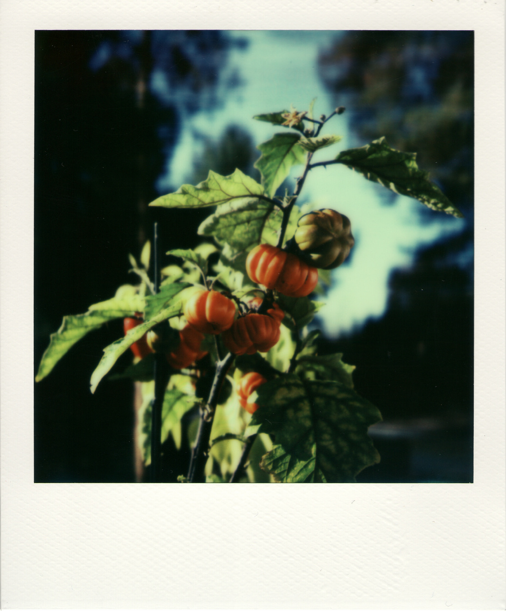
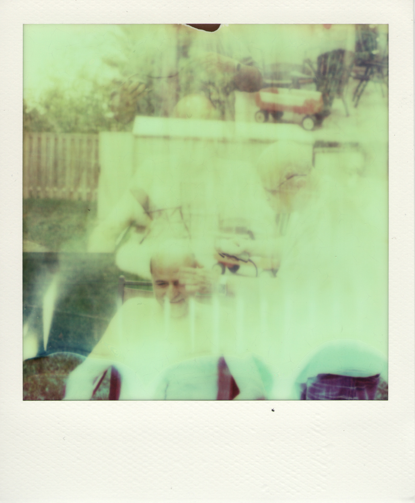
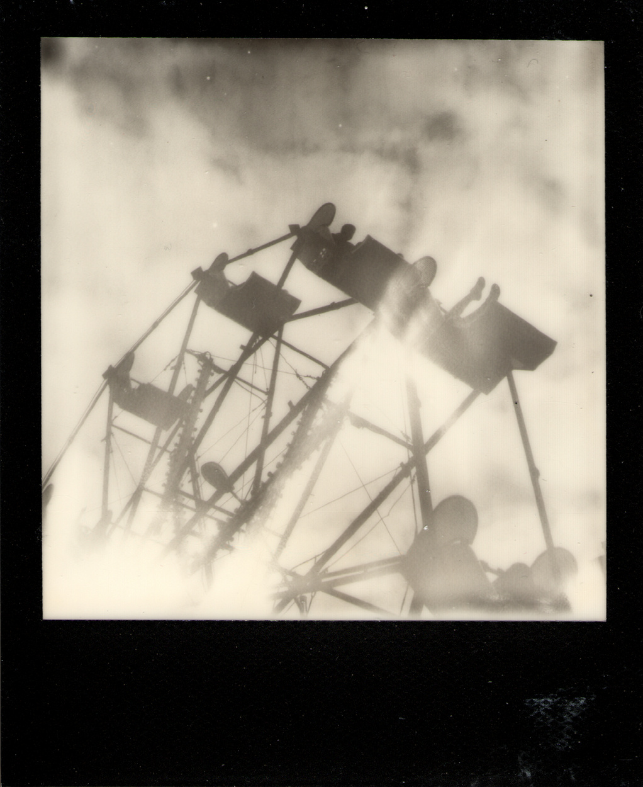
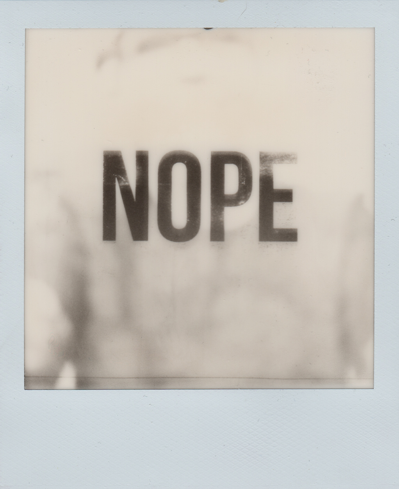

Polaroids
*********************

Basic Info
==========
- **Year:** 2012-2018
- **Materials:** Impossible Project/Polaroid Original Film
- **Dimensions:** individual images are 3.5" x 4.25"

Description
===========
In mid 2012, I became fascinated with the Polaroid SX-70. The camera is a folding SLR, and when released in 1972, it was Polaroid's first integral film camera. My first exposure to the SX-70 was `this video <https://youtu.be/Lo_1pyQ7xvc>`_, in which it just seems so marvelous.

Then, there is the story of `Jamie Livingston <http://en.wikipedia.org/wiki/Jamie_Livingston>`_. His photo a day project brought him from `1979 to 1997 <http://photooftheday.hughcrawford.com/>`_, with around 6,700 photographs. So, some combination of my interest in Jamie's story, and the technology of the camera, led me to purchase my own.

Related Projects
=================
The polaroids often find their way into other works, or form the basis of entirely new projects.

Polaroid Timelapse Videos
-------------------------
Embedded below is an example from a set of Polaroid timelapse development videos. This project was focused on observing the film's chemical conversion, and rendering that as a digital process. The resulting videos are just slow enough to lose track of what exactly is shifting in between each individual frame. In the case of images which were over-exposed, the development process gradually gains then loses detail before developing to completion.

.. raw:: html

    <iframe width="560" height="315" src="https://www.youtube.com/embed/w6E6odRck9A?rel=0" frameborder="0" allow="autoplay; encrypted-media" allowfullscreen></iframe>

NOPE Images
-----------
In a rare experiment with negation (instead of affirmation), the NOPE images are a set of pictures that have been taken with a thin plastic slide hidden inside the camera. The plastic slide has a single word printed on it, which is imprinted onto an over-exposed image as it is being taken.

Further Reading
==================
- **Blog posts:** `My SX-70 <https://maxlupo.com/my-sx-70/>`_, `Polaroid Timelapses <https://maxlupo.com/polaroid-project-1/>`_

- **Sample High resolution images:** https://drive.google.com/drive/folders/1sD1JBpgzKbwqGrRxxyVnWVnb-WmjVYnB
