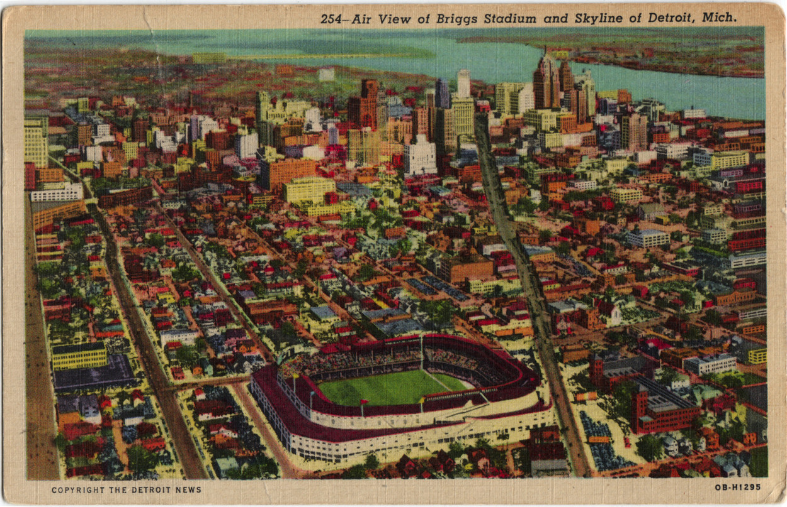

Postcard Return Project
*********************

Basic Info
==========
- **Year:** 2016
- **Materials:** found postcards
- **Dimensions:** variable

Description
===========
The Postcard Return Project is an artwork which explores home and nostalgia, through the act of manipulating forgotten postcards. Estate sales, antiques stores, and thrift shops are filled with objects removed of their original context and value. In these locations perhaps no object is more unbound from its former associations than the postcard–once the original sender and receiver have passed, where do they really belong?

.. raw:: html

    <iframe width="560" height="315" src="https://www.youtube-nocookie.com/embed/k2a-8Kf1Cj8?rel=0" frameborder="0" allow="autoplay; encrypted-media" allowfullscreen></iframe>

The postcards themselves are quotidian excerpts from an individual's life. The cards are both intensely specific to that person's lived experience, while also being indicators for the experiences of wider cultural and temporal groups. In my observation of responses to the postcards, this dual characteristic is consolidated into a visceral feeling of nostalgia. The installation provides the necessary postage, making it possible to **mail the original back to its original destination**, or a reproduction if there is the feeling that the original is just too precious.

Presentation Considerations
------------------------------

In its first installation, the postcards were arranged as seen above. The core of the project resides in the action of choosing and returning a postcard, and as such the specific arrangement of the cards can be completely changed to suit new exhibition environments.

Additional Postcards
=====================
Front:

Back:

Further Reading
==================
- **High resolution postcard scans:** https://drive.google.com/drive/folders/1b_J--PO2b8vb5ElDjifCBsIYzbk1CWK5
- **Didactic videos:** https://drive.google.com/drive/folders/1A13G9TTYoYjH2MAEx1zHRXxFJ8KnX1HP
