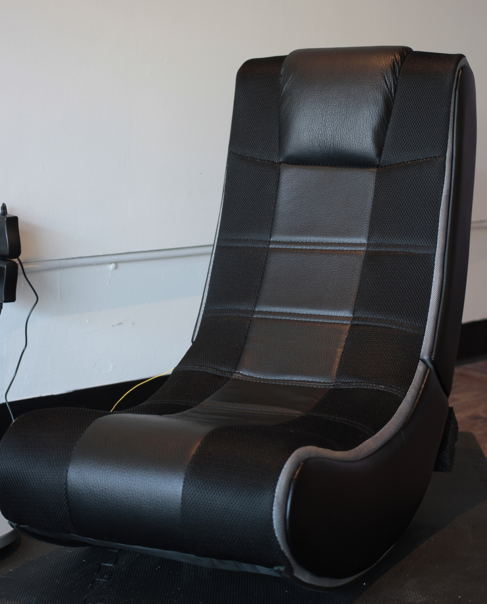

Slounge Chair
*********************

Basic Info
==========
- **Year:** 2017
- **Materials:** `V-Rocker SE Gaming Chair <https://www.bestbuy.ca/en-ca/product/x-rocker-v-rocker-se-gaming-chair-black-grey-5130301/10574294.aspx?>`_, Raspberry Pi
- **Dimensions:** w 17.5", h 17", d 25"

Description
===========
The Slounge Chair is a sound instalation made for the exhibition `Galaxy Champion FUN ZONE <https://maxlupo.com/galaxy-champion-fun-zone/>`_. That exhibition was concerned with using the tools and aesthetics of video games to explore the migrant histories of `Qendrim Hoti <http://qendrimhoti.com/>`_ and I. The structure of the piece is a "Gaming Chair"--essentially a rocking chair with speakers built in. Using this form, I inserted stories form my parents' arrival and acclimation to Canada, as well as their stories about their parents' life in Italy. In the Slounge Chair's newest incarnation, these stories are activated by a participant sitting down and rocking in the chair. Once the participant has done so, a soothing vibe will start to play followed by a recorded story.

Tech Specs and Maintenance
------------------------------
The artwork relies on a Raspberry Pi embedded within the device. To power it up, plug in the two barrel jacks on the devices lower right side. The chair’s speakers have a power on button which needs to pressed if not already on, and make sure the volume knob is turned to somewhere in the middle. The computer will power-up on its own once plugged in and take about 3 minutes to automatically start its program. Once started it can remain active all day.

To power down, hold the small black button down for 5 seconds. This will shutdown the computer inside the device. After about 1 minute, pull out the barrel jacks  to fully power down the device. If the barrel jacks are not removed, the device might not power on as these instructions have described.

I will provide an illustrated version of these instructions for the gallery attendants.

Sample Stories
=========================

Below are two example stories which can be found on the device.

.. raw:: html

    <audio controls="">
        <source src="https://github.com/mlupo/artwork-docs/blob/master/assets/Duckling.mp3?raw=true" type="audio/mpeg"/>
    </audio>

    <audio controls="">
        <source src="https://github.com/mlupo/artwork-docs/blob/master/assets/Jobs.mp3?raw=true" type="audio/mpeg"/>
    </audio>
       

Also, here is a playlist of the vibes used as a background track:

.. raw:: html

    <iframe width="100%" height="300" scrolling="no" frameborder="no" allow="autoplay" src="https://w.soundcloud.com/player/?url=https%3A//api.soundcloud.com/playlists/377500337&amp;color=%23ff5500&amp;auto_play=false&amp;hide_related=false&amp;show_comments=true&amp;show_user=true&amp;show_reposts=false&amp;show_teaser=true&amp;visual=true"></iframe>

Further Reading
==================
- **Blog post:** *forthcoming*
- **Full resolution images:** https://drive.google.com/drive/folders/163iiwcTAEeIUkCJk6Wv4jqs9rNRYg57s?usp=sharing
