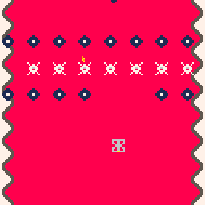
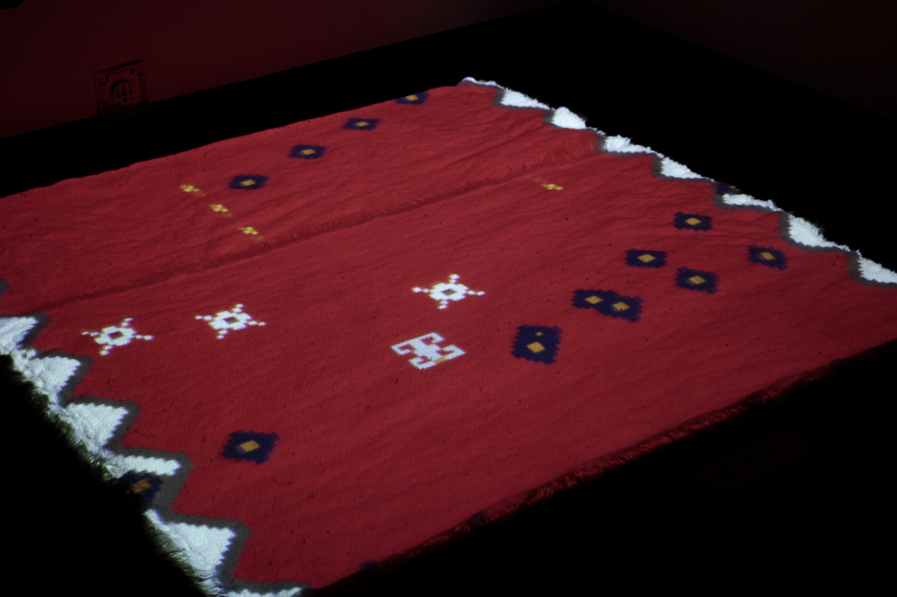
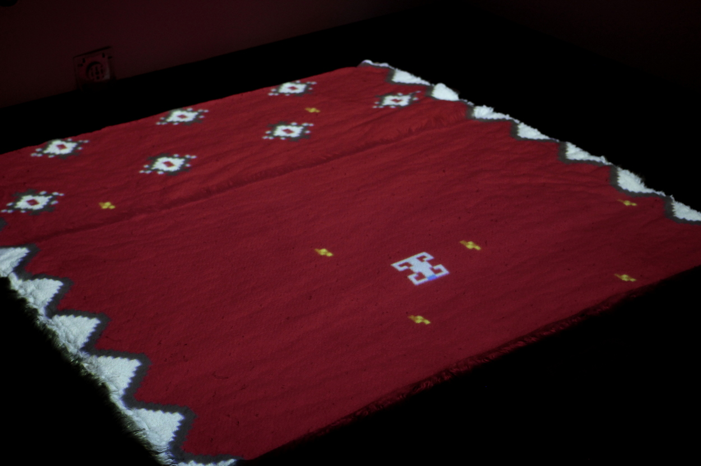

Space Kilim
*********************
.. raw:: html

    <iframe src="kilim.html" height="650px" width="600px"></iframe>

*once the game is loaded, press Z to begin playing. Z fires lasers, and the arrow keys move.*

Basic Info
==========
- **Year:** 2017
- **Materials:** `pico-8 game <https://www.lexaloffle.com/pico-8.php>`_, rug and projector for installation
- **Dimensions:** variable

Description
===========
This game was made in colloaboration with Qendrim Hoti for our duo exhibition `Galaxy Champion FUN ZONE <https://maxlupo.com/galaxy-champion-fun-zone/>`_. That exhibition centered around using modified/hacked video games to insert our personal migrant histories into a variety of virtual worlds. Space Kilim was an originial game created by Hoti and I to explore how 8bit computer graphics have an uncanny aesthetic similarity to the motifs found in woven rugs.

A `kilim <https://en.wikipedia.org/wiki/Kilim>`_ is a hand woven rug found in Morocco, Turkey, and Albania. The motifs used in the game are from a number of textiles in Qendrim's collection.

Technical details
------------------------------
The game itself can be played on any modern computer, either as a native executable or through a web-browser. In its initial installation, the game was played via a cieling mounted projector which projected the game down onto a white fur rug. In this installation, a dedicated controller was provided.

installation Images
====================

Further Reading
==================
- **Blog post:** *forthcoming*
- **Full resolution images:** https://drive.google.com/open?id=1YpvsGiPNQBql8XtTB4PqyiPdQUQyAkFM
- **Source files:** *forthcoming*
