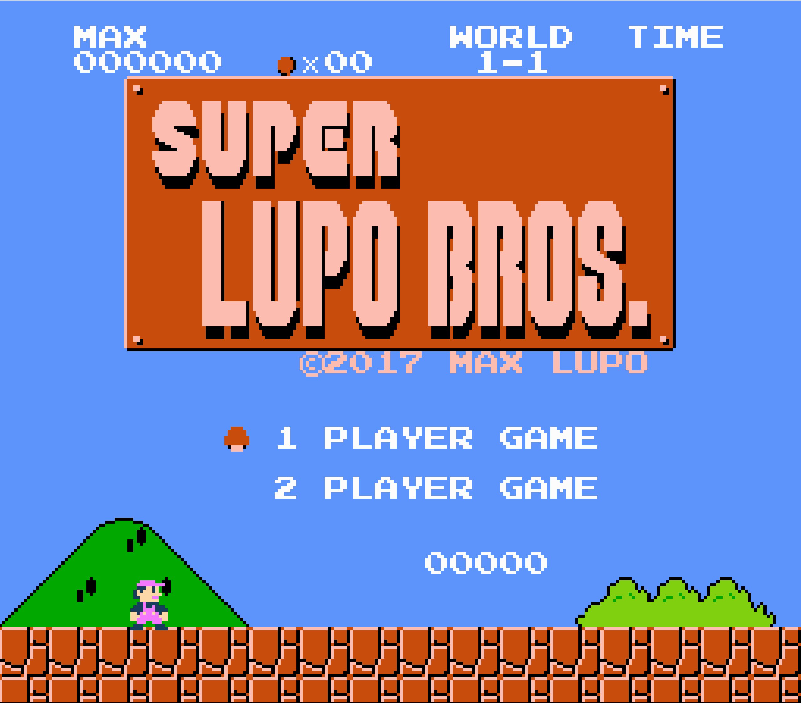
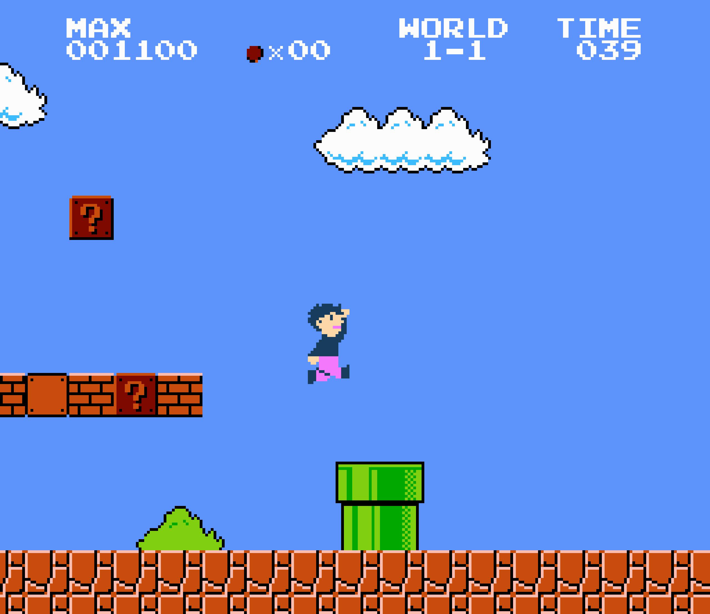
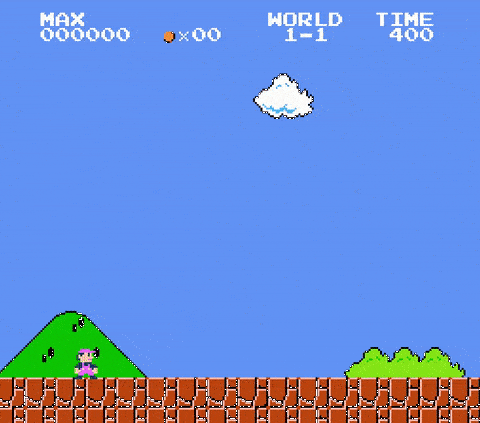
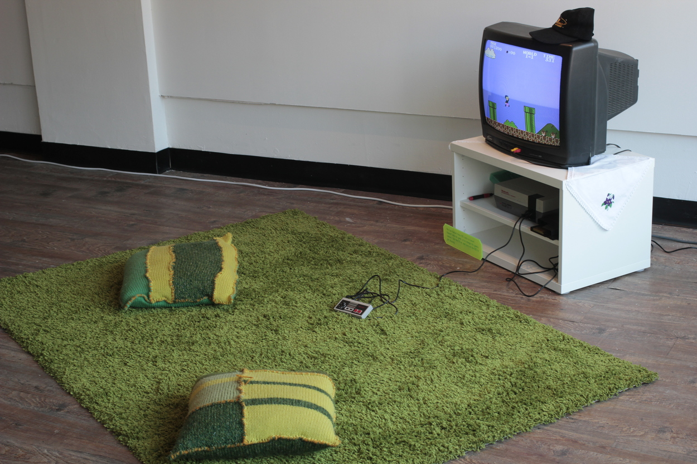

Super Lupo Bros.
*********************

Basic Info
==========
- **Year:** 2017
- **Materials:** NES game cartridge, NES system, CRT television
- **Dimensions:** variable

Description
===========
Super Lupo Bros. is a `mod <https://en.wikipedia.org/wiki/Mod_(video_gaming)>`_ of the classic NES game, Super Mario Bros. The impetus for this project was to take an example from my childhood video gaming experiences and insert my childhood back into that game. To that end, I edited a `rom <(https://en.wikipedia.org/wiki/ROM_image) >`_ of the original game, in order to swap the Mario sprite with one that more closely resembles me.

The modded version of the game has been loaded onto a cartridge that is playable in a real NES system. This was an important aspect of the project, as I wanted the sense of playing the game to fit into a player's memories and feelings of nostalgia. In it's most recent presentation, the installation explicitly referenced a home gaming environment, in order to help facilitate a gallery goers participation with the game.

Tech Specs and Maintenance
------------------------------
As noted above, the game is meant to run on vintage hardware using a number of specific materials, all of which I can provide. In terms of maintenance: the objects involved are standard consumer electronics which should not require excessive maintenance, and their use is reasonably straight forward. However, to extend the life of the materials, it is recommended to monitor the use of the system and TV, and turn them off if they have been unused for an extended period of time.

Additional Images
===================

Further Reading
==================
- **Blog post:** *forthcoming*
- **Full resolution images:** https://drive.google.com/drive/folders/1LYqTH-qkv7GNssrgICoKCctAqjZfsAFH?usp=sharing
