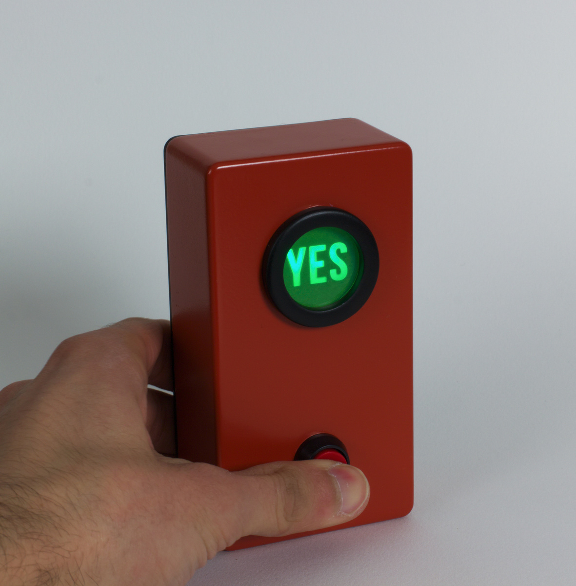
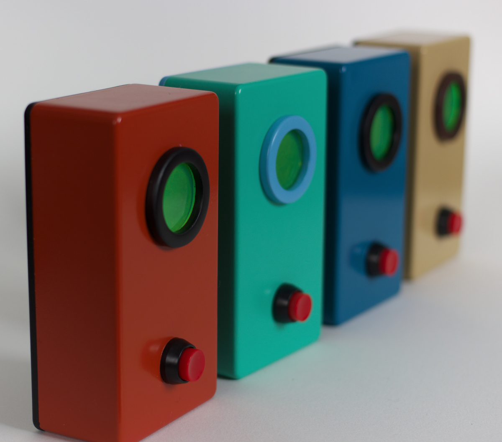
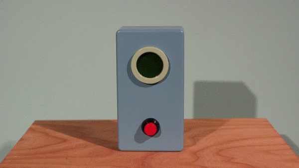

The Automatic Affirmation Device (Version 3)
********************************************

Basic Info
==========
- **Year:** 2014
- **Materials:** 3D printed plastic, misc electronics
- **Dimensions:** w 2.4", h 4", d 1.5"

Description
==============
The Automatic Affirmation Device is your personal confidence booster that is never wrong. Will today be a good day? Will I pass that test? Is this the best invention ever made? The answer is **YES**.

Tech Specs and Maintenance
--------------------------
The device is powered by a LED light, and two AAA batteries. In normal use, the batteries should last more than 4 years. Access to the batteries is possible by removing the 4 phillips screws which secure the back plate.

Additional Images
====================

Further Reading
===============
- **Blog post:** https://maxlupo.com/the-automatic-affirmation-device/
- **Full resolution images:** https://drive.google.com/drive/folders/1zjUPazpFdjb4juAJj-OG27j58QZ7upNX
- **Source files:**
    - 3D printing sources for Version 2, https://www.thingiverse.com/thing:7060
