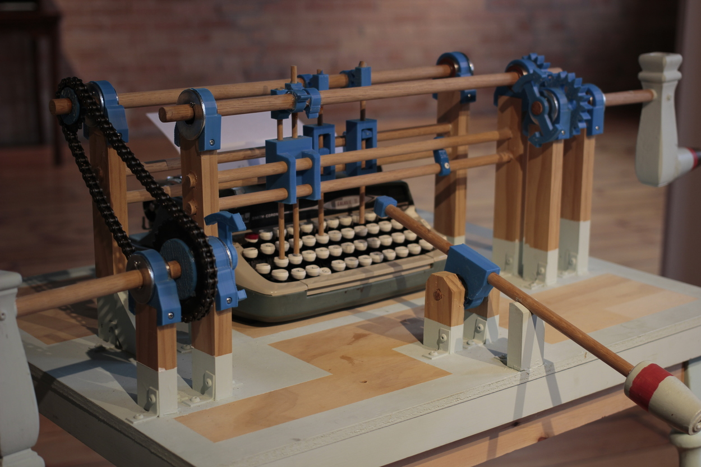
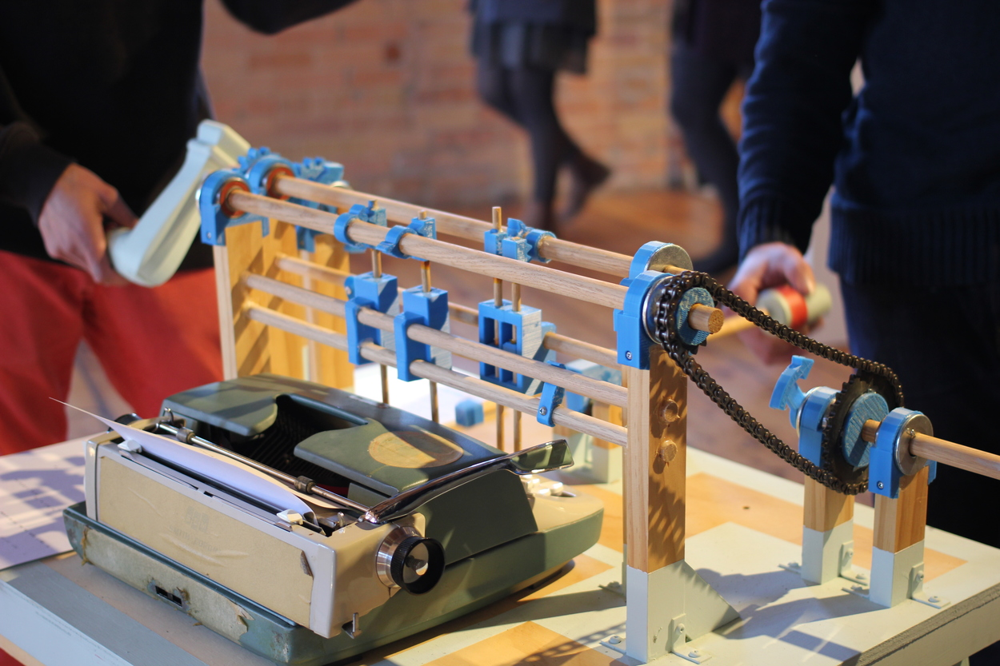
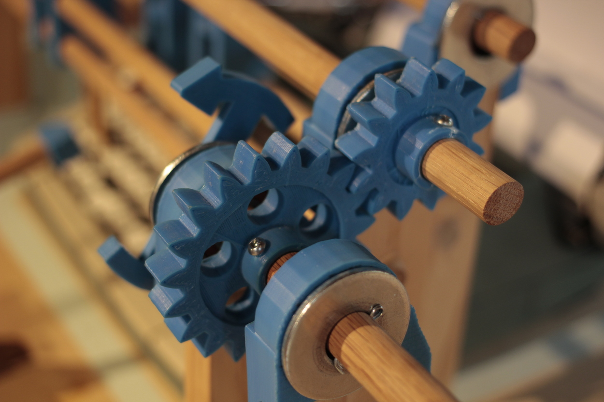
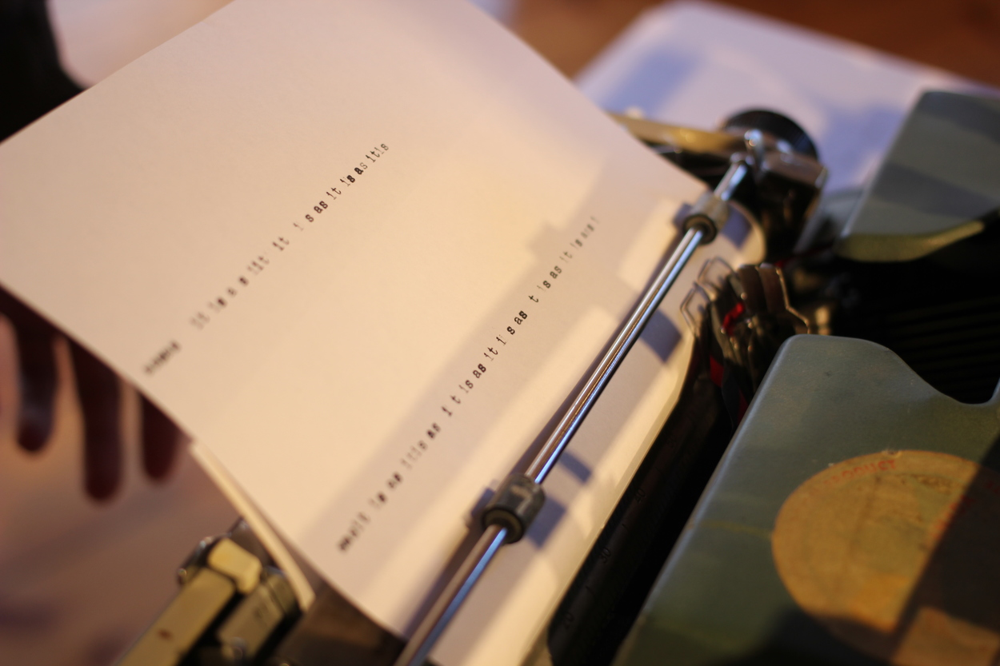

The Convenient Typer
*********************

Basic Info
==========
- **Year:** 2011-2012
- **Materials:** Typewriter, wood, 3D printed parts
- **Dimensions:** w 42", h 38", d 30"

Description
===========
This is an apparatus designed to allow three people to conveniently type out a specific phrase: it is as it is. Each person must time their actions specifically, and operate their portion of the device with care.

This device was made to be a performance at a local art-event. Its operation is (of course) far from convenient, but it does type out the most true thing I could think of at the time.

In its installation I guide the use of the machine through a comic persona who is there to force the proper and specific use of the machine. The Convenient Typer was born out of my fascination with music boxes, and is the precursor to Beep-Boopatronics.

Tech Specs and Maintenance
------------------------------
The difficulty with this device is that it was made to look interesting and inviting, but it is not a "toy" or "playable" in the way some visitors expect. Once set up, it can be used to type out its iconic phrase, but typically only with my guidance.

Additional Images
=================

Further Reading
==================
- **Full resolution images:** https://drive.google.com/drive/folders/19FvznejvT-RSg51gSwAqq5Mg-UemFmVk
- **Source files:** https://www.thingiverse.com/thing:16954
