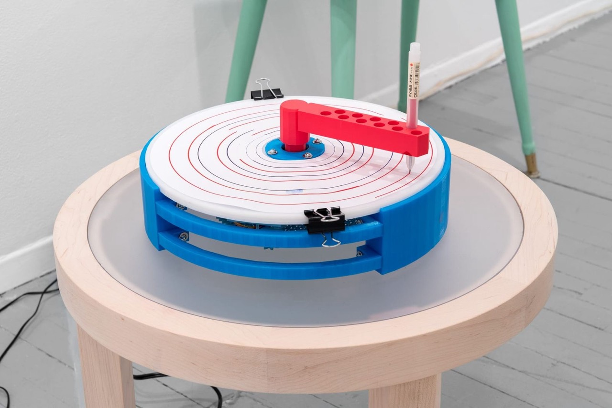
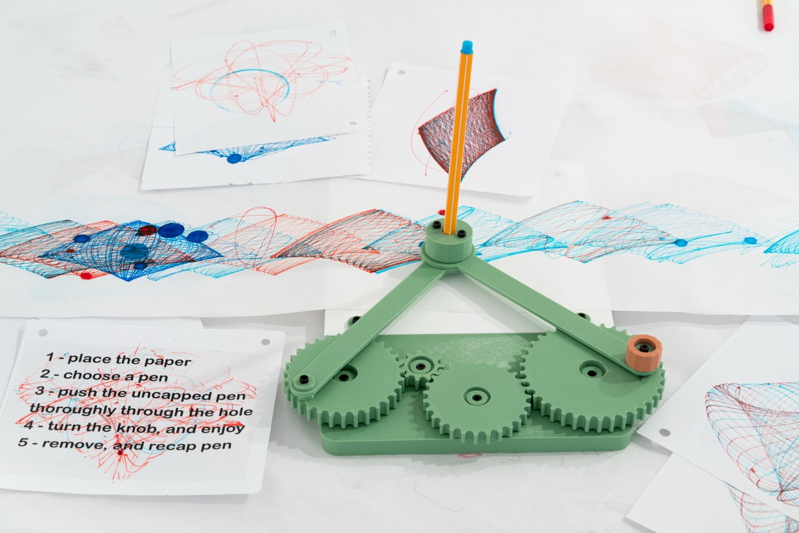
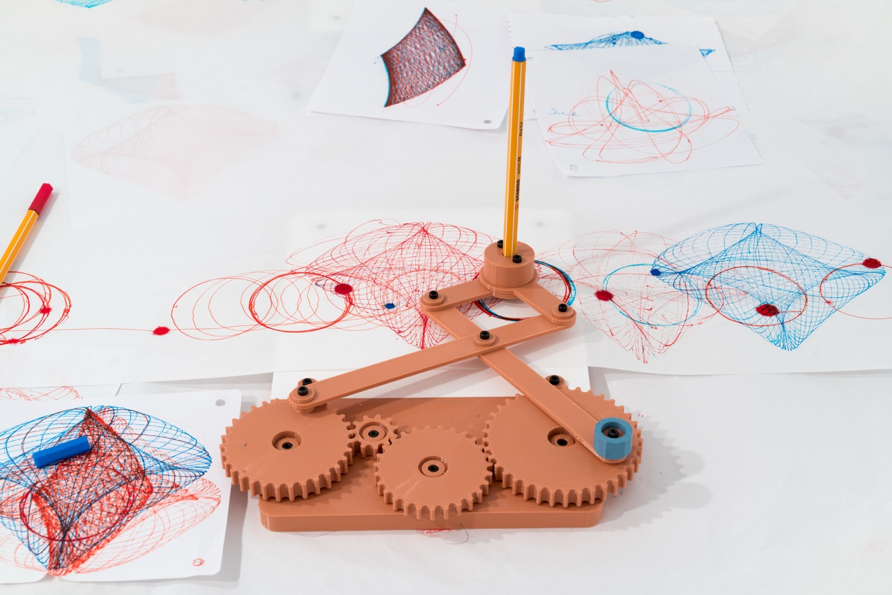
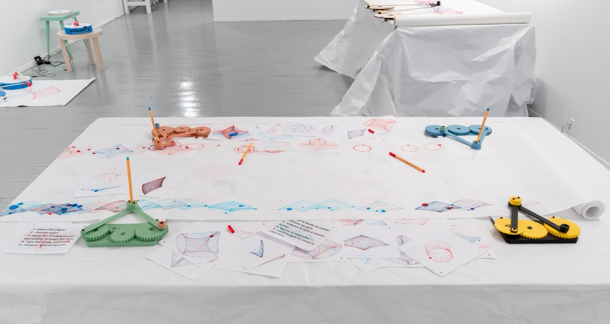
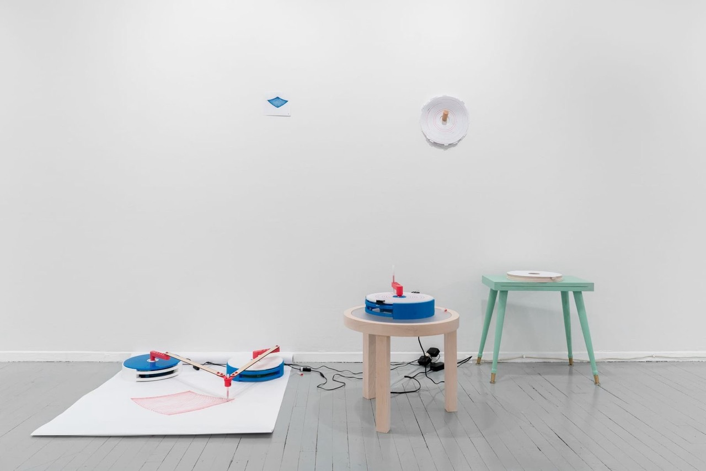

The Margin Maker
*********************

Basic Info
==========
- **Year:** 2023
- **Materials:** 3d printed plastic, paper roll, microcontroller, servos
- **Dimensions:** variable

Description
===========
The Margin Maker was a collaborative installation created with Pascaline Knight and presented in Montreal at `Arprim, centre d'essai en art imprimé <https://www.arprim.org/programmation/2023-2024/452-pascaline-knight-max-lupo.html#englishversion>`_ in 2023. Pascaline and I inverted, condensed, and disassembled the Hilroy Canada Exercise Book, used by many students in their primary grade studies. The starting point of the exhibition was the idea to create a useless Margin Making device (pictured above), which would endlessly create an unusable margin.

Pascaline used the device to create multiple studies and arrangements of the resulting artifacts, and used them to reflect on her printmaking practice. For my part, I created a series of harmonographs which cased the ruled line to fold over itself with attendee participation (pictured below).

Additional Images
=================

*all photos by Jean-Michael Seminaro*

Further Reading
==================
- **Blog post:** https://maxlupo.com/the-margin-maker/
- **Exhibition text by Justine Kohleal** https://www.arprim.org/programmation/2023-2024/452-pascaline-knight-max-lupo.html#englishversion