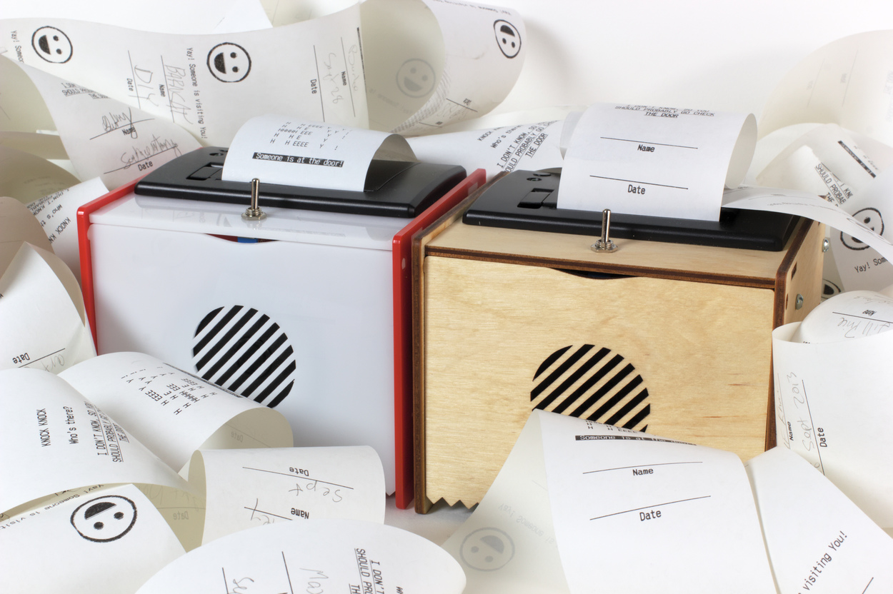
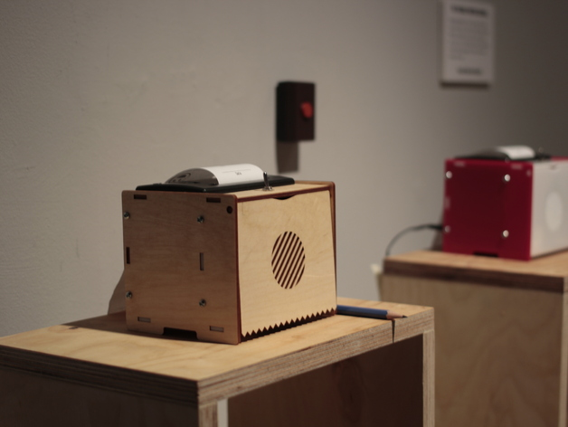

The Thermal Printing Doorbell (Version 2)
******************************************

Basic Info
==========
- **Year:** 2014
- **Materials:** Arduino, laser cut wood and acrylic, thermal printer, thermal paper
- **Dimensions:** w 5", h 4.5", d 4"

Description
===========
Doorbells are boring. Everyone deserves a doorbell which introduces them to their visitor in an inviting way.

This is the Thermal Printing Doorbell. It plays a little melody, then leaves you a delightful, or passive-aggressive message. The truth is, answering the door is alternatively annoying or terrifying. The people that you would actually like to see most likely do not ring the doorbell anyway, and so the person at your door is more likely some other surprising interjection into your day.

Tech Specs and Maintenance
------------------------------
In terms of technology, the device includes an Arduino, a thermal printer, and a small remote which provides the ringer button. The remote is powered by 2 `CR2016 <https://www.amazon.com/Energizer-CR2016-Lithium-Battery-3V/dp/B000RB00CK>`_ coincell batteries, which should last 2 years with normal use. The thermal printing paper used is `this one here from Staples <https://www.staples.ca/en/Staples-Thermal-POS-Solid-Wall-Core-2-1-4-x-60-35-Pack/product_1587850_1-CA_1_20001>`_, or anything that is a similar size.

The main device has a single power switch. Once flipped on, the green light beside the printer will slowly flash, and the device is immediately usable. To power down, simply flip the switch to its off position. This device requires power from an outlet to operate.

Installation Image
==================

Further Reading
==================
- **Blog post:** https://maxlupo.com/the-thermal-printer-doorbell/
- **Full resolution images:** https://drive.google.com/drive/folders/1ngHTP24S-2AepOyWIApd-OQyAtExlTsi
- **Source files:** https://www.thingiverse.com/thing:729301
