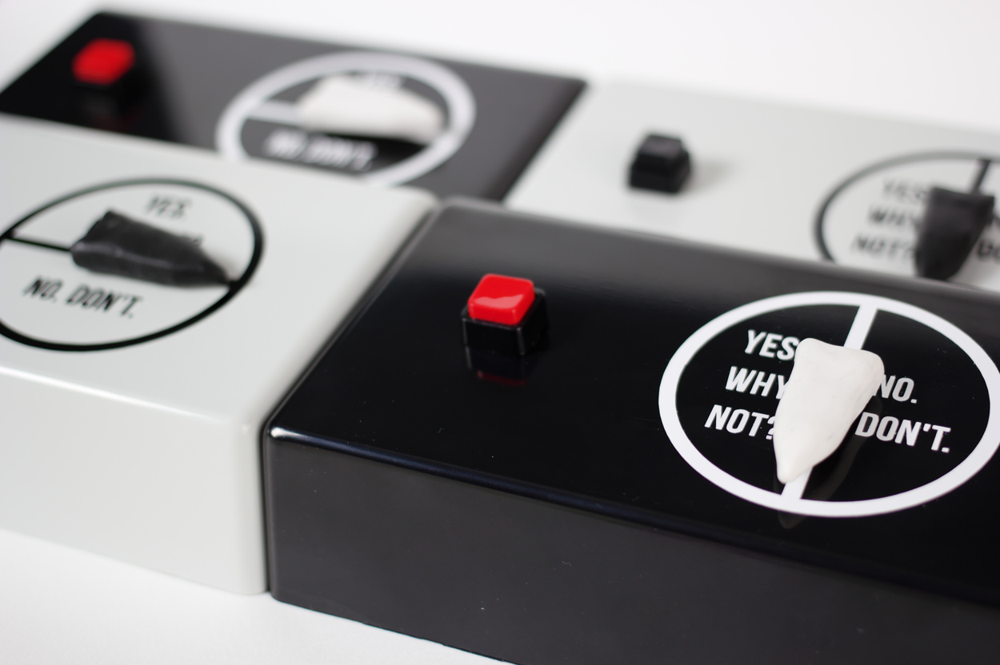
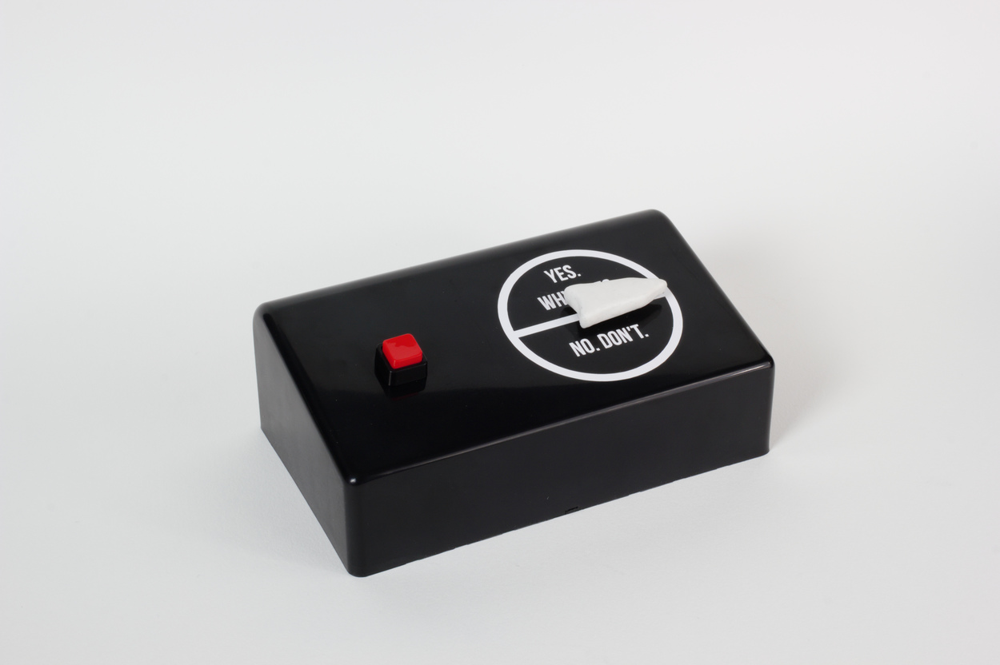

The Ultimate Indecision Machine
*******************************

Basic Info
==========
- **Year:** 2014
- **Materials:** DC motor, magnets, plastic enclosure
- **Dimensions:** w 6”, h 3”, d 3.5”

Description
===========
The Ultimate Indecision Machine is a device that will never help you make up your mind.

    *Should I quit my job, or stay where I am?*

    . . .

    *Should I finally do that one thing. . . or not?*

Ask any question while holding the button down on the face of the device. Release the button and watch as the needle snaps to the center-line, right in-between yes and no.

Tech Specs and Maintenance
------------------------------
The device contains a small dc motor, powered by a single AA battery. The battery should last about a year with regular use.

Additional Images
====================

Further Reading
==================
- **Full resolution images:** https://drive.google.com/drive/folders/1gd9OjvEuFlxmuXLSlgKP9Og3ywLWFIPP
