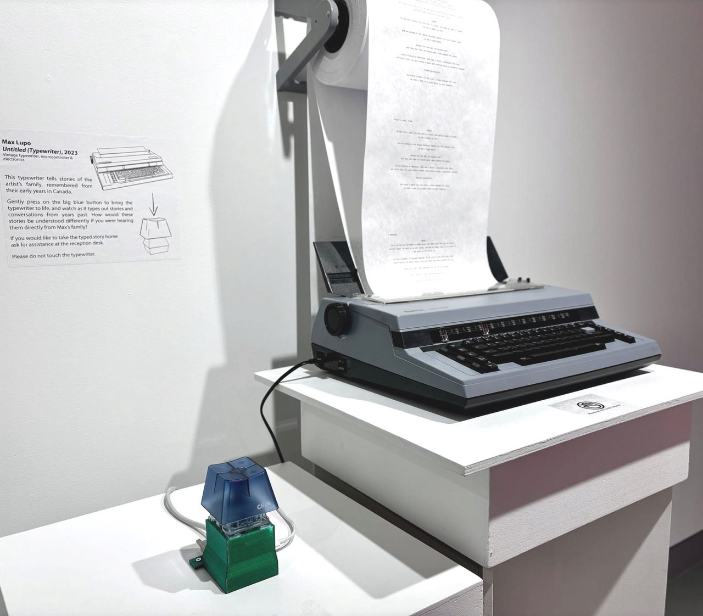
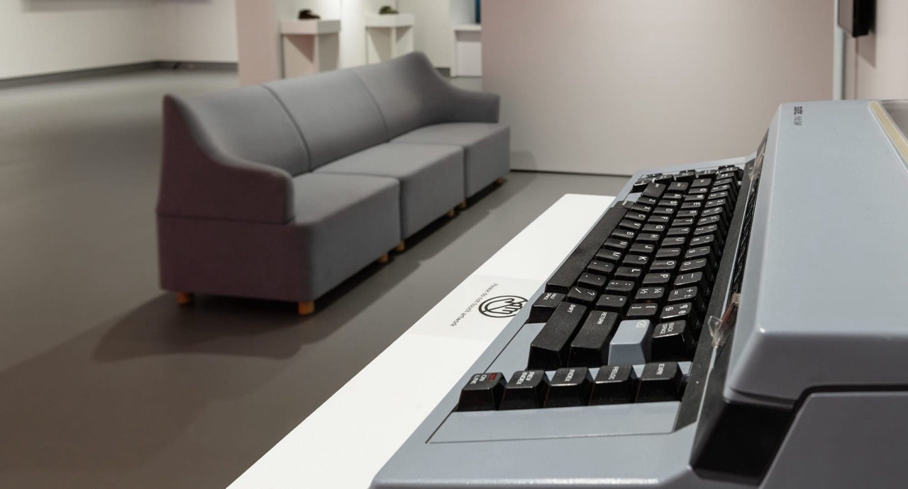

Untitled (typewriter)
*********************

Basic Info
==========
- **Year:** 2023
- **Materials:** typewriter, 3d printed plastic, paper roll, microcontroller
- **Dimensions:** variable

Description
===========
In 2017 I had the opportunity to record some family stories which were presented as part of the exhibition `Galaxy Champion FUN ZONE <https://maxlupo.com/galaxy-champion-fun-zone/>`_. These audio recordings, focused on my parents' experience of immigrating to Canada from Italy in the 1960s & 70s, gave some insight into what their lives were like in those early years, as well as how their own parents adjusted. Untitled (typewriter) is a way to materialze these stories at the push of a button: simply press the large blue button, and the typewriter will automatically tip-tap out a the text of a family story.

First installed at the Latcham Art Centre in 2023 for the exhibition `Continous Memory <https://www.latchamartcentre.ca/exhibitions/max-lupo-and-jose-andres-mora-continuous-memory/>`_, an exhibition which won Exhibition of the Year – Budget under $10,000 at the 47th Annual GOG Awards.  

.. raw:: html

   <iframe width="560" height="315" src="https://www.youtube.com/embed/qL10OkWF220?si=p2oseuInUR9H4pZ3" title="YouTube video player" frameborder="0" allow="accelerometer; autoplay; clipboard-write; encrypted-media; gyroscope; picture-in-picture; web-share" referrerpolicy="strict-origin-when-cross-origin" allowfullscreen></iframe>

Tech Specs and Maintenance
------------------------------
This project can be operated continously with a roll of paper installed overhead, as was the case in its intial presentation at the Latcham Art Centre. I have replacement printer ribbons and rolls of paper at the ready. Keep in mind that the typerwriter is a vintage piece of technology, and while it was user friendly by 1980s standards, it does take some care to work with today.

Additional Images
=================

*photo by Dennis Hristrovski*

Further Reading
==================
- **Blog post:** https://maxlupo.com/untitled-typewriter-and-continuous-memory/
- **Latcham Art Centre exhibition page** https://www.latchamartcentre.ca/exhibitions/max-lupo-and-jose-andres-mora-continuous-memory/
- **Source files:** https://github.com/mlupo/type-type